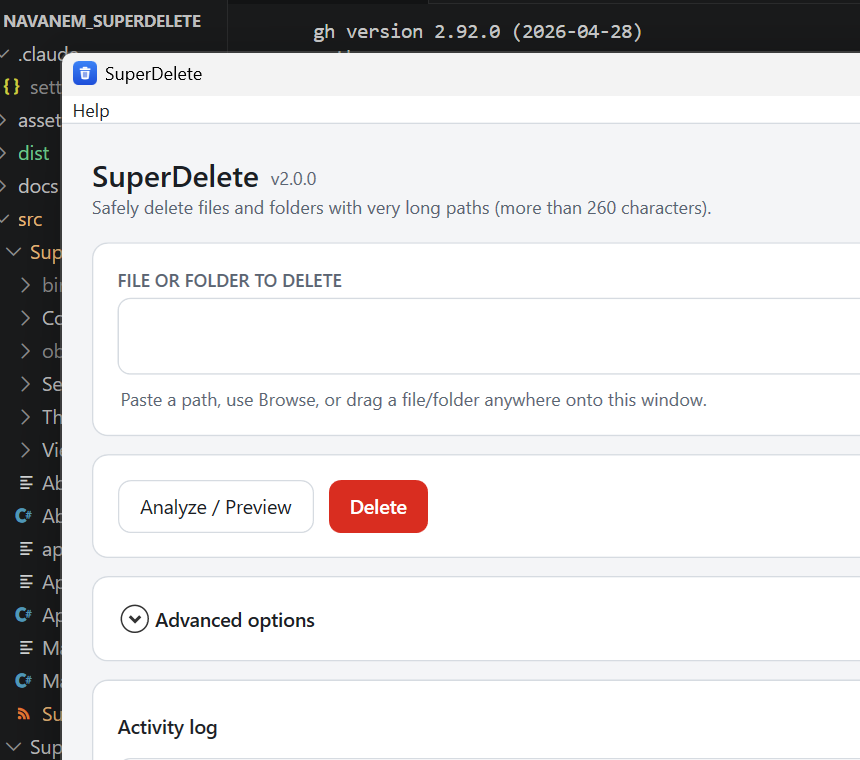

<h1 align="center">
  <br>
  SuperDelete
</h1>

<p align="center">
  Safely delete files and folders with <b>very long paths</b> (more than 260 characters) —
  from the command line <i>or</i> a modern desktop app.
</p>

<p align="center">
  
</p>

---

### About

Windows normally blocks file paths longer than the classic `MAX_PATH` of **260 characters**, which makes
some files and folders impossible to delete with Explorer or `del`/`rmdir`. SuperDelete removes them by
using extended-length paths (`\\?\`) together with the Unicode Win32 functions for enumerating and
deleting files — supporting paths up to **32 767 characters**. It can also **bypass ACL checks** when the
user has administrative rights on the drive (useful when a disk was moved from another machine or Windows
installation).

More on the mechanism: MSDN —
[Naming Files, Paths, and Namespaces](https://learn.microsoft.com/windows/win32/fileio/naming-a-file),
section *Maximum Path Length Limitation*.

SuperDelete ships in **two forms that share one deletion engine**:

- **`SuperDelete.exe`** — the original command-line tool (same flags, same behavior).
- **`SuperDeleteUI.exe`** — a sober, modern WPF desktop app, so a non-technical user can delete a long
  path safely without using a terminal.

---

### Download

Grab the latest pre-built, **self-contained** executables from the
[**Releases**](https://github.com/navanem/navanem_SuperDelete/releases) page — no .NET installation
required, just download and run:

| File | What it is |
|---|---|
| `SuperDeleteUI.exe` | The desktop app (double-click to launch). |
| `SuperDelete.exe` | The command-line tool. |

> For **Bypass ACL**, right-click the executable → **Run as administrator**.

---

### Project layout

| Project | Type | Purpose |
|---|---|---|
| `src/SuperDelete.Core` | class library (`net8.0-windows`) | The shared deletion engine: long-path delete, preview/analysis, result models, service interfaces. Single source of truth. |
| `src/SuperDelete.Cli` | console app (`net8.0-windows`) | Thin CLI over the engine. Builds to **`SuperDelete.exe`**. |
| `src/SuperDelete.App` | WPF app (`net8.0-windows`) | The desktop UI over the same engine. Builds to **`SuperDeleteUI.exe`**. |

The engine is exposed through interfaces (`IDeletionService`, `IPathAnalyzer`) and reports progress via
`IProgress<DeletionProgress>`, so it carries no console/UI dependency. See
[`docs/NOTES.md`](docs/NOTES.md) for design decisions and future improvements.

---

### Build from source

Requires the **.NET 8 SDK** (`dotnet --version` ≥ 8.0). From the repository root:

```
dotnet build SuperDelete.sln -c Release
```

To produce the self-contained single-file executables yourself:

```
dotnet publish src/SuperDelete.App -c Release -r win-x64 --self-contained true ^
  -p:PublishSingleFile=true -p:IncludeNativeLibrariesForSelfExtract=true -p:EnableCompressionInSingleFile=true -o dist/ui
dotnet publish src/SuperDelete.Cli -c Release -r win-x64 --self-contained true ^
  -p:PublishSingleFile=true -p:IncludeNativeLibrariesForSelfExtract=true -p:EnableCompressionInSingleFile=true -o dist/cli
```

> The project is Windows-only: it depends on Win32 APIs (`kernel32`, `advapi32`, `ntdll`) and WPF.

---

### Run the CLI

The CLI is unchanged from the original tool. It takes a single file or folder path plus optional switches.

```
SuperDelete.exe <full path to file or folder>           # with confirmation
SuperDelete.exe --silentMode <path>                     # or -s : skip the confirmation prompt
SuperDelete.exe --bypassAcl <path>                      # bypass ACLs (run as Administrator)
SuperDelete.exe --printStackTrace <path>                # print full call stack on error
```

Switches can be combined and the order does not matter. During development:

```
dotnet run --project src/SuperDelete.Cli -- -s "C:\some\very\long\path"
```

---

### Run the desktop app

Double-click `SuperDeleteUI.exe`, or during development:

```
dotnet run --project src/SuperDelete.App
```

To use **Bypass ACL** from the UI, start it **as administrator** — the option is available either way, and
an indicator reminds you when it is enabled.

#### Screens

The window is a single, sober utility screen organized top-to-bottom:

1. **Header** — app name, version, one-line description, a **Help → About** menu, and a **Dark mode** toggle.
2. **File or folder to delete** — a path box plus **Browse file…** / **Browse folder…**. You can also
   **paste** a path or **drag-and-drop** a file/folder anywhere onto the window. A **Recent** dropdown lists
   paths used during the session.
3. **Actions** — **Analyze / Preview**, **Delete** (danger-styled), and **Cancel** (while busy). A progress
   bar shows the current item and a live `files · folders` count.
4. **Summary** (after Analyze) — type (file/folder), existence, **path length** with a badge when it
   exceeds 260 characters, item counts, an amber note for access/ACL or reparse-point concerns, and a red
   **warning** before recursive deletion.
5. **Advanced options** — **Preview only** (dry run, deletes nothing), **Bypass ACL** (with a visible
   "enabled" indicator), **Show diagnostic details**, and a short explanation of the long-path limitation.
6. **Activity log** — timestamped, real-time log with **Clear** and a collapsible **Technical details**
   panel (stack traces) shown when something fails.
7. **Status bar** — a colored final status: green = success, amber = cancelled/partial, red = failure.

Safety behaviors: a real deletion always asks for an **explicit confirmation** naming the target and item
count; **Preview only** never changes anything; the UI stays responsive during long deletes and the
operation can be **cancelled** mid-run.

---

### License

Apache License 2.0 — see [LICENSE](LICENSE).
